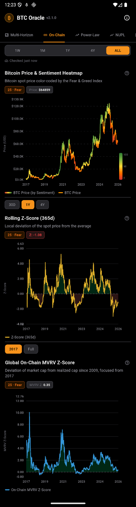
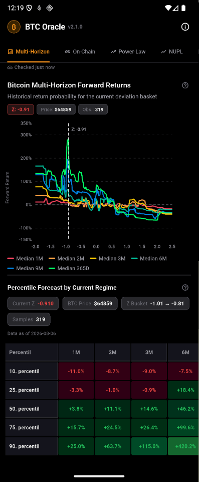
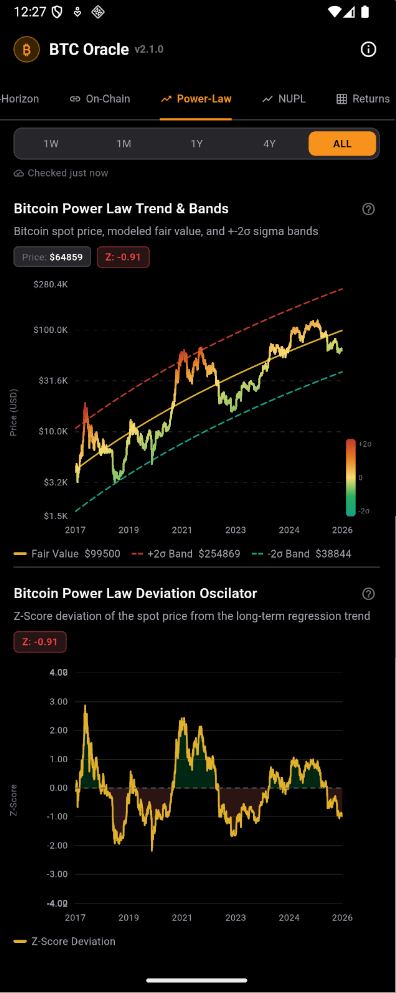
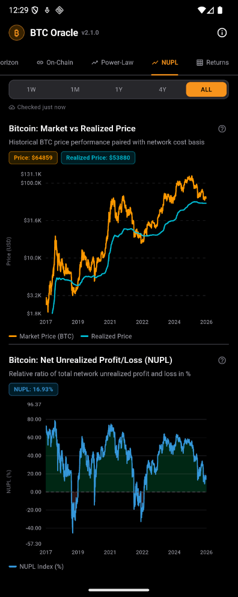
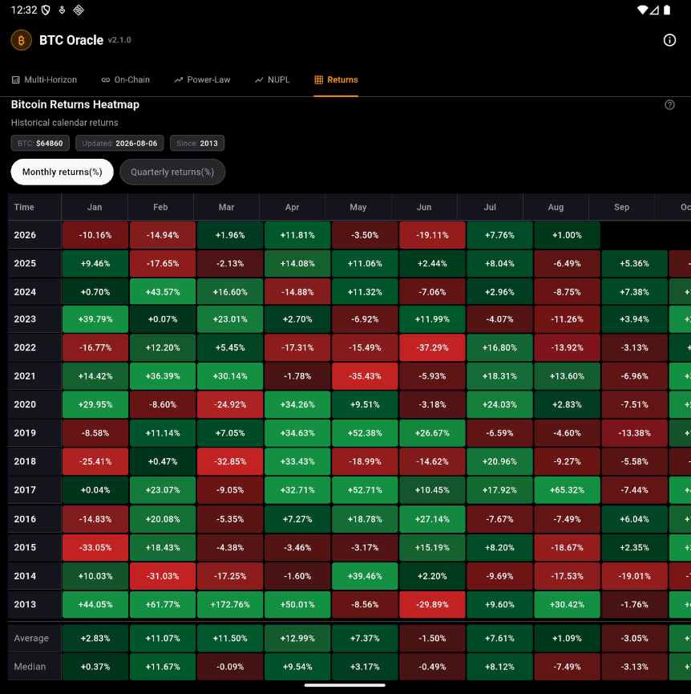

# BTC Oracle: Power-Law & On-Chain Analytics Pipeline

A fully automated data engineering pipeline designed for incremental data ingestion, advanced statistical modeling, and micro-service API delivery of Bitcoin (BTC) macro metrics. The system combines the Power-Law (logarithmic regression) mathematical model with on-chain fundamentals and market sentiment to feed optimized data payloads to mobile clients.

---

## Architecture & Tech Stack
* **Language & Frameworks:** Python (Pandas, PyArrow, NumPy), FastAPI
* **Data Storage:** Parquet (Local columnar storage), PostgreSQL (Production relational DB)
* **Environment & Deployment:** Docker, Linux `cron` scheduler, `tmux` process multiplexer
* **Data Sources:** Binance API, CoinMetrics (GitHub), Alternative.me API

---

## Key Engineering Features


* **Incremental Data Ingestion:** Data fetchers automatically check existing local assets and fetch only the newest missing data records from external APIs.
* **Quantitative Analytics & Financial Modeling:** Designed, backtested and calibrated macro-indicators (e.g., Power-Law log-log regressions, Multi-Horizon forward returns, NUPL, MVRV Z-Scores) to visualize raw price and on-chain metrics.
* **Autonomous Backfill:** Analytics engines inspect the PostgreSQL state before execution. If data gaps are detected, they perform a linear backfill. If the database is empty, a full historical backfill from 2017 is triggered automatically.
* **Optimized Columnar Storage:** Local raw data is saved in the highly efficient `.parquet` format using the `pyarrow` engine, minimizing disk I/O and RAM overhead.
* **Unified Database Time-Matrix:** Long-term historical data is stored in a normalized relational matrix `btc_metrics_series` using a composite index `(date, metric_name)`. This allows infinite scaling for new metrics without modifying the DB schema.
* **Flutter UI Optimization:** Complex time-series calculations are pre-rendered and aggregated into a `daily_charts` table as optimized JSON snapshots. This strictly isolates analytical workloads from API requests and significantly reduces network traffic for mobile devices.

---

## Repository Structure

```text
├── data/                             # Columnar Parquet data layer (Auto-generated)
│   ├── BTC_1d.parquet                # Historical 1-day OHLCV price data from Binance
│   ├── BTC_onchain.parquet           # On-chain fundamentals (Market Cap, Realized Cap)
│   ├── BTC_fear_and_greed_index.parquet 		# Market sentiment data from Alternative.me
│   └── on_chain_data_manual.txt      # CoinMetrics stopped 2026-05-21 need manual import of (Market Cap, Realized Cap)
├── execution_and_export/             # Master Analytical Engines (Calculations & DB Export)
│   ├──nupl.py						  # Net unrealized profit/loss and Market vs realized price
│   ├──onchain_mvrv_analysis_and_fear_and_greed_index_calculation_and_export.py 	# MVRV Z-Score modeling and macro heatmap generation
│   ├──power-law_binance_multi_horizonts_calculation_and_export.py 					# Forward Return matrix probabilities & History Buckets
│   ├──power-law_binance_oscilator_calculation_and_export.py						# Log-regression, Fair Value curves, and ±2σ band calibration
│   └── table_historical_return.py	  # BTC calendar heatmap month/quarter...
├── FastAPI/                          # FastApi layer
│   ├── main.py             		  # FastAPI main file
│   └── README.md                     # FastAPI readme file
├── output/                           # Calculations outputs
│   ├── graphs/                       # Graphical outputs
│   └── summary/                      # Text output
├── tools/                            # Core ETL Utilities & Configuration
│   ├── config.py                     # Centralized project configuration & environment validation
│   ├── db_exporter.py                # Database connection driver with auto-fallback routing
│   ├── binance_prices_fetcher.py     # Incremental Binance API price fetcher
│   ├── coinmetrics_fetcher.py        # Snake_case transformed on-chain data fetcher
│   └── Fear_and_greed_index_fetcher.py    # Optimized alternative.me API sentiment ingestion
├── run_pipeline_async                # Master orchestrator Bash script triggered by Cron
├── requirements.txt				  # Required libraries 
└── README.md                         # Project documentation
```

---

## Database Schema Design (PostgreSQL)

### 1. `btc_metrics_series` (Normalized Time-Series)
A lean relational matrix storing pure numerical history without data duplication.
* **Schema:** `date (DATE)` | `metric_name (VARCHAR)` | `value (NUMERIC(16,4))`
* **Tracked Metrics:** Spot Price, Fear & Greed, MVRV (Rolling/Global Z-Scores), Power-Law Z-Scores, Fair Value curves, ±2σ bands, and Forward Return Median Horizons (1M to 365D).

### 2. `daily_charts` (Pre-Aggregated JSON Payloads)
Stores pre-processed visual datasets mapped to fixed record IDs for lightning-fast API distribution.
* **Schema:** `id (VARCHAR)` | `chart_date (DATE)` | `category (VARCHAR)` | `doc (JSON)`
* **Production Endpoint IDs:**
  * `current_btc_price_fng_heatmap` -> Spot price paired with sentiment data.
  * `current_btc_rolling_z_score_XXXXd` -> Moving on-chain momentum oscillator.
  * `current_btc_global_onchain_mvrv` -> Long-term macro valuation metrics.
  * `current_btc_power_law_price_trend` -> Log-regression baseline with ±2σ channels.
  * `current_btc_power_law_deviation_oscillator` -> Price deviation Z-Score oscillator.
  * `current_btc_power_law_multi_horizons` -> Forward return probability matrix.

---

## API Delivery & Inbound Requests
The production environment features an independent micro-service layer driven by **FastAPI** running as a continuous background process inside a **`tmux`** session.

To maximize network efficiency and minimize mobile data consumption, the system implements an intelligent conditional caching mechanism:
* The `/status` Endpoint: Instead of blindly downloading heavy chart datasets upon every screen transition or app launch, the Android client first queries a lightweight `/status` endpoint.
* Timestamp Verification: This endpoint responds with a list of available metric tables along with their latest generation time in Unix timestamp format.
* Smart Data Fetching:The Flutter application compares these server timestamps with its locally cached data. The full JSON dataset from the PostgreSQL `daily_charts` table is requested and transferred *only* if the server database has a newer timestamp. 

If the data is up-to-date, no heavy queries are executed and no data is downloaded. This architecture guarantees lightning-fast view transitions under a few milliseconds while drastically reducing server load and client-side bandwidth usage.

---

## Mobile Application UI (Flutter Client)

*Note: The frontend code is kept in a separate proprietary repository. Below are live production previews of how the FastAPI JSON data payloads are visually rendered inside the Flutter Android Client.*

### Price and sentiment


### Power-law metrics



### NUPL


### Returns table

